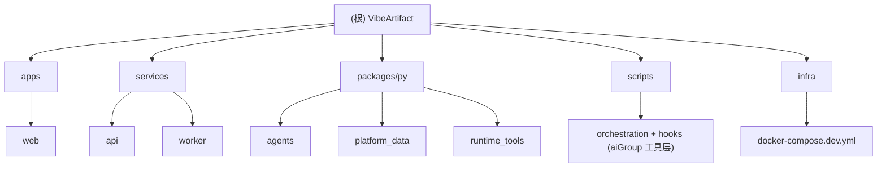

# PROJECT_CONTEXT.md

> 项目实例上下文。本文件是 `docs/README.md` 知识库地图中 "项目实例上下文" 的落地文档，由 `init-architect` 生成/维护，供 Agent 与开发者快速理解 VibeArtifact 代码库的实际形态。

## 项目愿景

**VibeArtifact** 是一个 **AI Product Engineering OS**（对标 anything.com 一类"文字转应用"产品，面向大学生快速完成课程项目/作业场景）：用户输入一个模糊的产品想法，系统自动完成需求收敛（intent → contraction）、任务规划（planner）、数据/接口建模（schema）、并行代码生成（backend + frontend，各自带 reviewer 多轮评审）、文档与图表生成（doc + diagram，同样带评审）、质量门禁与修复（gate/repair loop），最终打包导出可运行的全栈 MVP（export：Next.js 前端 + FastAPI 后端 + PostgreSQL + Docker Compose）。

"Vibe" 代表灵感与直觉，"Artifact" 代表可交付的工程产物 —— 目标是让每一个产品灵感都能在分钟级内落地为可运行的 MVP。

核心机制：
- **Agent 流水线 + 评审配对**：9 个流水线 Agent（intent、contraction、planner、schema、backend、frontend、doc、diagram、export）通过 DAG 依赖关系分层调度；backend/frontend/doc/diagram 各配对一个 reviewer，在执行步内经 LangGraph 驱动"author 写 → reviewer 评 → author 改"的有界多轮循环（默认 3 轮，见 `packages/py/agents/agents/executors/conversation_graph.py`）。
- **工作区文件驱动**：Agent 产物（代码/文档/图表）直接落到 `workspace_files` 表（run 级文件工作区，`(run_id, file_path)` 唯一 + version 递增），Gate 校验、修复回路、ZIP 导出均以此为唯一数据源。
- **国产模型接入**：LLM 全部走国产厂商（DeepSeek / 通义千问 DashScope / Moonshot Kimi / MiniMax），经 LangChain 原生集成（`runtime_tools.llm.chat_model_factory`），代码不写死默认厂商，由环境变量按推理型/生成型两档配置。
- **Gate + 修复回路**：代码生成后跑编译/结构门禁（`runtime_tools.gates`），失败时自动进入修复回路（重跑相关 Agent，配对 Agent 仍带评审循环），仍失败则标记 `needs_attention` 并通过 SSE 通知前端。

> 注：本仓库同时承载了 **aiGroup 开发协作框架**（Claude Code + Codex 双硬件层 Agent Team 工作流，见根 `CLAUDE.md` / `docs/rules/` / `.claude/agents/` / `.claude/skills/` / `scripts/`），用于辅助本项目自身的 AI 结对开发。这一层是"开发 VibeArtifact 所用的工具"，与"VibeArtifact 产品本身"是两个不同的关注面，本文档以产品代码库为主，工具层见下方"AI 使用指引"。

## 模块结构图



## 模块索引

| 模块 | 路径 | 语言/技术 | 一句话职责 | CLAUDE.md |
|------|------|-----------|-----------|-----------|
| web | `apps/web/` | Next.js 15 + React 19 + TypeScript | 用户交互界面：项目/会话/生成/委托运行的全部前端页面 | [apps/web/CLAUDE.md](../apps/web/CLAUDE.md) |
| api | `services/api/` | FastAPI + Python 3.12 | 平台核心 API：认证、项目、会话（SSE 聊天）、生成分析、全权委托运行、工作区文件、产物 | [services/api/CLAUDE.md](../services/api/CLAUDE.md) |
| worker | `services/worker/` | Celery + Python 3.12 | 异步任务处理：DAG 编排、逐层调度 Agent（配对 agent 走评审循环）、Gate 检查与修复回路 | [services/worker/CLAUDE.md](../services/worker/CLAUDE.md) |
| agents | `packages/py/agents/` | Python（Pydantic + LangGraph） | Agent 基础设施：9 流水线 Agent + 4 Reviewer 的 Schema/Prompt/Config/Runner、ConversationGraph 评审循环、容量计算、冷启动分析 | [packages/py/agents/CLAUDE.md](../packages/py/agents/CLAUDE.md) |
| platform_data | `packages/py/platform_data/` | Python（SQLAlchemy 2 + Alembic） | ORM 模型（含 workspace_files/conversation_turns）、Repository、UnitOfWork —— 平台数据层 | [packages/py/platform_data/CLAUDE.md](../packages/py/platform_data/CLAUDE.md) |
| runtime_tools | `packages/py/runtime_tools/` | Python（LangChain + Redis） | 运行时工具：国产模型 ChatModel 工厂、Cost Tracker + 价格表、Gate 校验器、ZIP 导出 | [packages/py/runtime_tools/CLAUDE.md](../packages/py/runtime_tools/CLAUDE.md) |
| scripts（aiGroup 工具层） | `scripts/` | Node.js (CJS) + Bash | Agent 协作产物工作区 CLI（`.orchestration/`）与 Claude Code hooks dispatcher | [scripts/CLAUDE.md](../scripts/CLAUDE.md) |

未生成独立 CLAUDE.md 的目录（非代码模块，属配置/产物/知识库本体）：`docs/`（本知识库）、`.claude/`（Claude Code 已安装的 agents/skills/commands，属 aiGroup 安装产物，见 `.aigroup.json`）、`manifests/`（aiGroup 安装清单）、`infra/`（Docker Compose 基础设施定义）、`tests/`（根级集成测试占位，当前仅 `.gitkeep`）。

## 运行与开发

前置要求：[uv](https://docs.astral.sh/uv/)（Python 包管理）、[pnpm](https://pnpm.io/) v10+、Node.js 20+、Docker & Docker Compose。

```bash
# 安装依赖
make install                # uv sync --all-packages && pnpm install（apps/web）

# 启动基础设施（PostgreSQL + Redis）
make dev-infra               # docker compose -f infra/compose/docker-compose.dev.yml up -d

# 数据库迁移
cd services/api && uv run alembic upgrade head && cd ../..

# 分别启动三个服务（各自终端）
make dev-api                 # uvicorn api_app.main:app --reload --port 8000
make dev-worker               # celery -A worker_app.celery_app worker --loglevel=info
make dev-web                  # pnpm dev（apps/web，默认 :3000）

# 停止基础设施
make stop
```

访问 `http://localhost:3000`。前端通过 `NEXT_PUBLIC_API_URL`（默认 `http://localhost:8000`）访问 API。

## 测试策略

```bash
make test     # uv run pytest && (cd apps/web && pnpm build)
make lint     # uv run ruff check . && (cd apps/web && pnpm lint)
make gate     # lint + test
```

- **Python**：`pytest`，测试路径见根 `pyproject.toml` 的 `[tool.pytest.ini_options].testpaths`：
  `services/api/tests`、`services/worker/tests`、`packages/py/platform_data/tests`、`packages/py/agents/tests`、`packages/py/runtime_tools/tests`。`asyncio_mode = "auto"`，`--import-mode=importlib`。
- **Python lint**：`ruff`（`line-length = 120`，`select = ["E", "F", "I", "W"]`），少数 few-shot 示例文件对 `E501` 单独放行。
- **前端**：`eslint`（`apps/web/eslint.config.mjs`）+ `next build` 作为构建期检查；未见独立单测/组件测试配置。
- **CI**（`.github/workflows/ci.yml`，触发于 `main`/`dev` 分支 push 和 PR）：三个并行 job —— `lint`（ruff + pnpm eslint）、`test-python`（起 Postgres 16 + Redis 7 服务容器，跑 `uv run pytest`）、`build-web`（`pnpm --filter web build`）。

## 编码规范（项目特定）

- Python 3.12+，代码注释与文档字符串使用中文（见现有源码风格：模块/函数级中文 docstring，说明参数与返回值）。
- Ruff 规则集 `E/F/I/W`，行宽 120。
- uv workspace 内部依赖通过 `[tool.uv.sources] xxx = { workspace = true }` 声明；新增 Python 内部依赖时需在对应 `pyproject.toml` 补充 `dependencies` + `[tool.uv.sources]`（当前 `services/worker` 与 `services/api` 存在运行时导入未在 `pyproject.toml` 声明的情况，见 `docs/ARCHITECTURE.md` "已知技术债"）。
- Git 提交遵循 Conventional Commits（`feat` / `fix` / `refactor` / `docs` / `style` / `test` / `chore` / `ci`），中文描述（见根 `README.md` 贡献指南）。
- 跨语言通用编码/测试/安全/性能规范见 `docs/rules/`（本项目已通过 aiGroup 安装 `quality`、`workflow`、`backend`、`database`、`product`、`python`、`frontend` 模块，见 `.aigroup.json`）。

## AI 使用指引

- 本仓库已通过 `aigroup init` 安装 aiGroup 工作流框架（`.claude-plugin/plugin.json` 标识为 `aigroup-workflow`），根 `CLAUDE.md` 为导航入口，`docs/rules/agents.md` 定义 Agent Team 派遣矩阵，`docs/workflow-pipeline.md` 定义工作流 phase 心智模型，`docs/red-flags.md` 定义危险信号。
- 已安装模块（`.aigroup.json`）：skills `quality / workflow / backend / database / product / python / frontend`；agents `agents-core / agents-quality / agents-language`。
- 处理本项目的复杂功能/bugfix/重构任务时，遵循根 `CLAUDE.md` 中的 Agent Team 协议，而非直接单点编码。
- 涉及 Agent 流水线本身改动（`packages/py/agents/`、`services/worker/worker_app/orchestrator/`）时，优先阅读对应模块 `CLAUDE.md` 与 `docs/ARCHITECTURE.md` 的数据流章节，理解 工作区/评审循环/Gate 的完整链路后再动手。

## 变更记录（Changelog）

| 日期 | 变更 |
|------|------|
| 2026-07-10 | 架构重构（R1-R3）：删除 `ir_core` 包与 IR/快照/Lease Lock 体系，Agent 产物改存 `workspace_files` 表；LLM 接入从 LiteLLM（Anthropic/OpenAI）切换为 LangChain 原生国产模型集成（DeepSeek/通义/Kimi/MiniMax）；backend/frontend/doc/diagram 改为 author↔reviewer 配对（LangGraph 多轮评审循环，轮次落库 `conversation_turns`），撤销独立 qa agent。本文档与 `docs/ARCHITECTURE.md` 同步更新。 |
| 2026-07-09 | init-architect 首次全量扫描：创建 `docs/PROJECT_CONTEXT.md`、`docs/ARCHITECTURE.md`、8 个模块级 `CLAUDE.md`（apps/web、services/api、services/worker、packages/py/{ir_core,agents,platform_data,runtime_tools}、scripts）与 `.claude/index.json`。根 `CLAUDE.md` 已是纯导航形态，未改动内容，仅确认其知识库地图已覆盖 `docs/PROJECT_CONTEXT.md` 与 `docs/ARCHITECTURE.md` 链接。 |